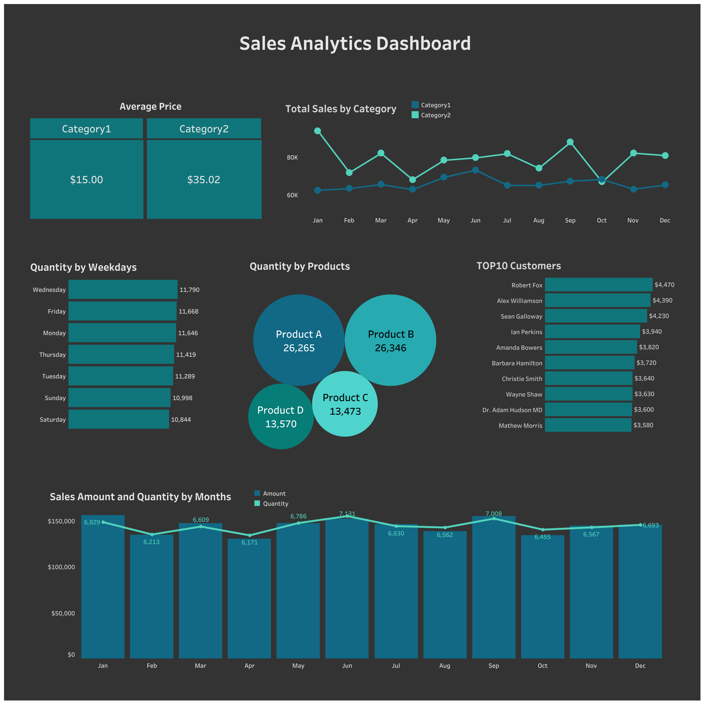

# Sales Analytics Dashboard

## Project Overview

This dashboard is focused on analyzing yearly sales performance across products, categories, customers, and time periods.

The main goal of the dashboard is to provide a clear overview of sales dynamics, identify the best-performing products and categories, compare average prices by category, and highlight the most valuable customers.

The dashboard includes monthly sales trends, sales amount and quantity dynamics, product-level quantity analysis, average price by category, weekday sales distribution, and the top 10 customers by sales amount.

## Key Business Questions

- How did sales change throughout the year?

- Which months had the highest and lowest sales performance?

- Which categories generated the highest sales?

- What is the average price in each category?

- Which products had the highest sales quantity?

- How does sales quantity vary by weekday?

- Who are the top customers by total sales amount?

- Does the sales amount trend align with the sales quantity trend?

## Insights and Recommendations

The dashboard shows that sales remained relatively stable throughout the year, with some monthly fluctuations. Based on the category sales trend, **Category2** generally demonstrates stronger sales performance than **Category1**, making it an important category for the business.

The average price in **Category2** is **$35.02**, while the average price in **Category1** is **$15.00**. This suggests that Category2 may contribute more to total revenue due to its higher average price. It is recommended to analyze the profitability of this category in more detail and support it through product availability, promotions, and sales focus.

The highest sales quantity is generated by **Product B** and **Product A**, with both products reaching around **26K units sold**. These products can be considered key demand drivers. It is recommended to monitor their stock levels closely and use them in promotional campaigns or cross-selling strategies.

The highest sales quantity by weekday is observed on **Wednesday**, **Friday**, and **Monday**. This information can be useful for planning marketing campaigns, promotional activities, or customer communications on the days with higher purchasing activity.

The top customer is **Robert Fox**, with a total sales amount of **$4,470**. Other top customers have relatively close sales values, which indicates a group of valuable customers. It is recommended to use this information for loyalty programs, personalized offers, and repeat purchase strategies.

Overall, the dashboard indicates stable yearly sales performance. The main growth opportunities may be related to developing Category2, supporting best-selling products, and improving customer retention among top buyers.

## Tools

PostgreSQL, Tableau

## Links
- [Tableau Dashboard](https://public.tableau.com/views/SalesAnalytics_17717849575290/Dashboard1?:language=en-US&:sid=&:redirect=auth&:display_count=n&:origin=viz_share_link)
